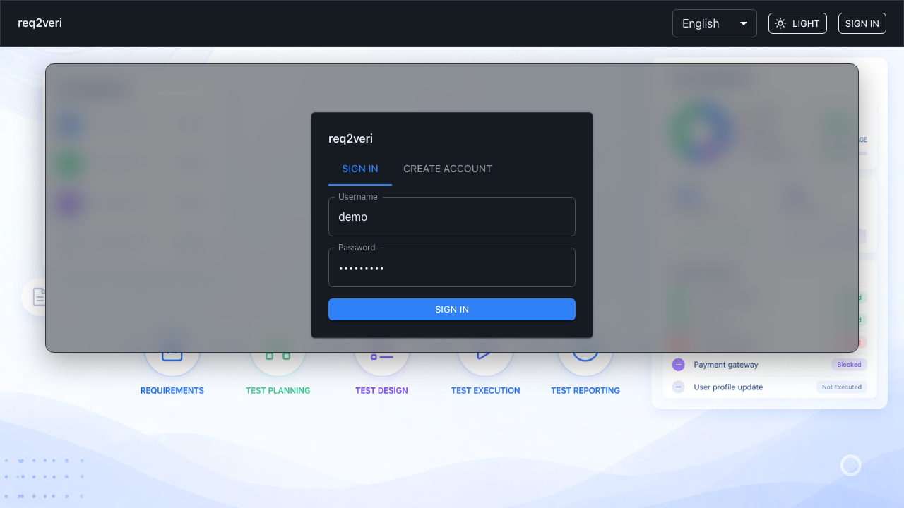
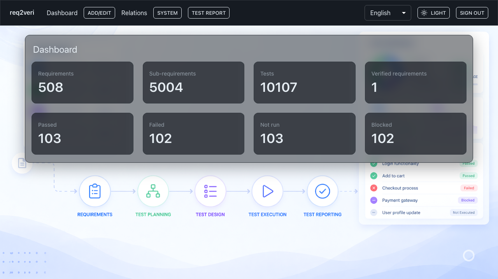

# Sign in

Access to requirements, tests, and reports is **authenticated**. Use a user that exists in the system (e.g. seeded `demo`).

## 1. Login form

**Why:** Only signed-in users can use dashboard, requirements, and test reporting.

**How:** Open `/login`, enter **Username** and **Password**, then click **Sign in**.

---

## 2. Dashboard after sign-in

**Why:** Confirms a successful session and shows high-level project status at a glance.

**How:** After a valid login, the app routes you to **Dashboard** automatically.

---

