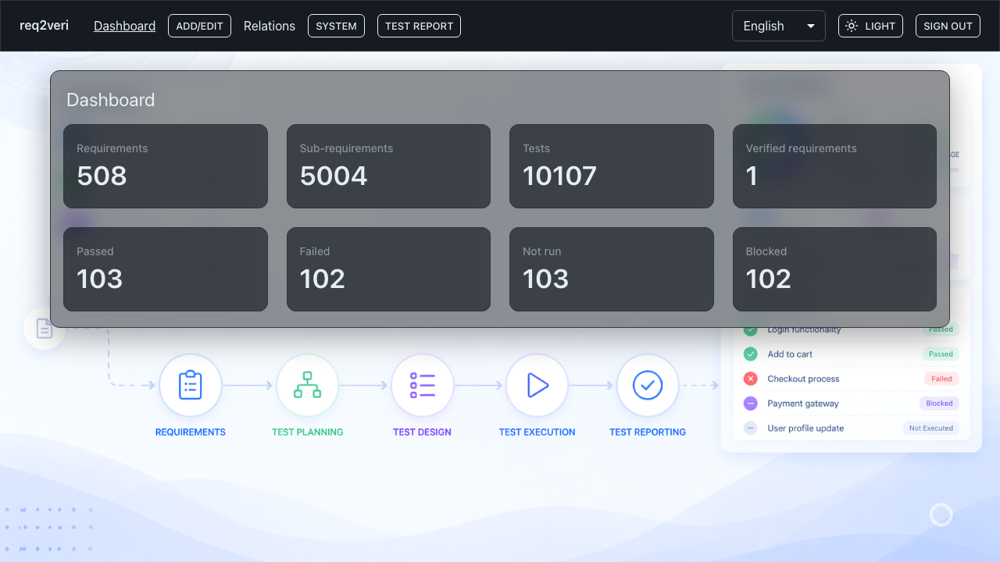

# Dashboard

The **Dashboard** summarizes requirements, tests, and recent test-run outcomes.

## 1. Summary tiles

**Why:** Quickly see counts of requirements, tests, and pass/fail/block trends without opening lists.

**How:** Use the top link **Dashboard** (or the app title to go home, then dashboard if needed).

---

