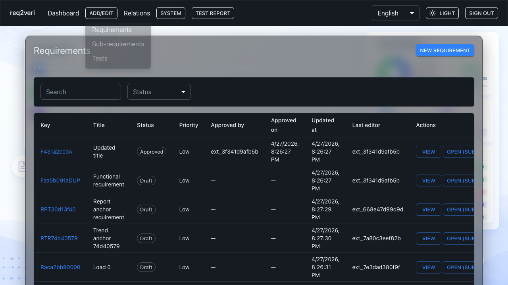

# Requirements

**Requirements** are the top-level need statements you trace to verification tests.

## 1. Requirement list

**Why:** You search and open requirements to read detail, add sub-requirements, and see approval metadata.

**How:** **Add/edit** → **Requirements** (or the **Requirements** entry in the same menu) opens the list.

---

