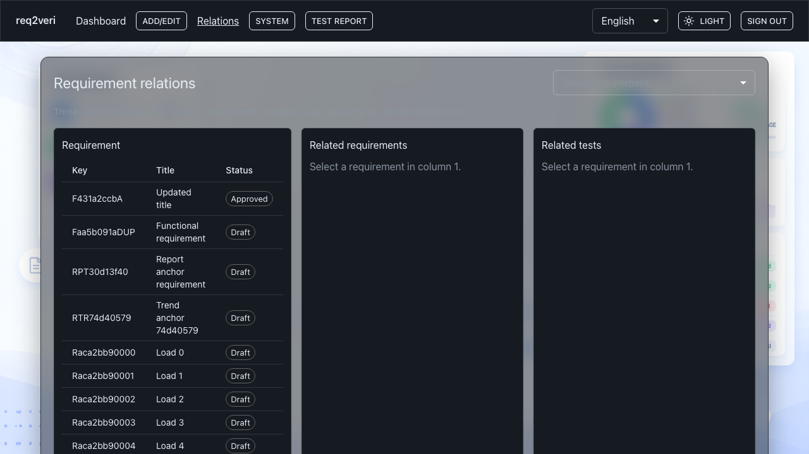

# Requirement relations

**Traceability** from a chosen requirement to related sub-requirements and tests.

## 1. Traceability view

**Why:** Verify that a requirement is covered by the right sub-requirements and test cases for audits.

**How:** Click **Relations** in the bar, pick a requirement in the first column, then read the other columns.

---

