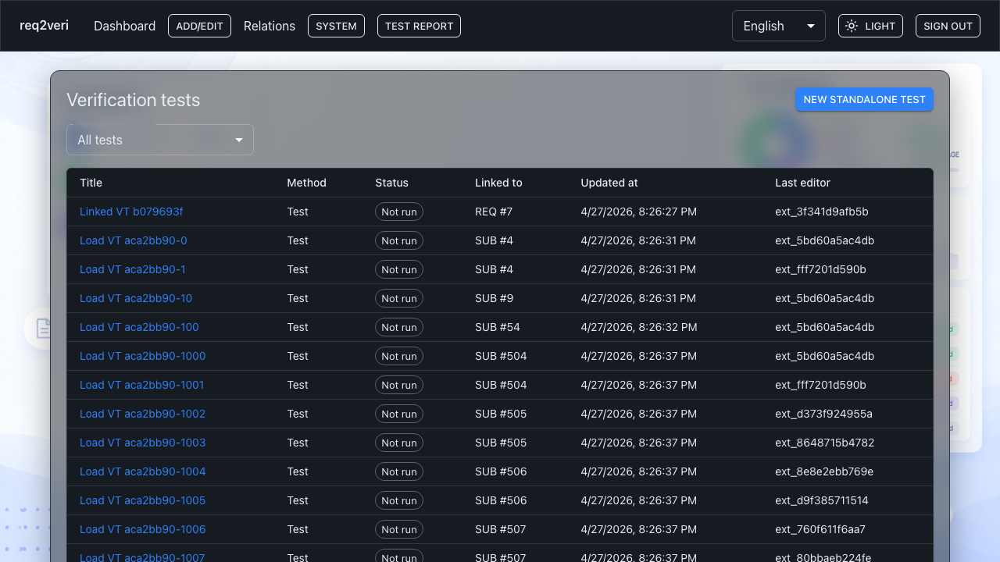

# Verification tests

**Verification tests** are the test cases you run against system versions and record results for.

## 1. Test list

**Why:** Create and maintain test definitions and see how they link to requirements or sub-requirements.

**How:** **Add/edit** → **Tests** to open the catalog (URL `/tests`).

---

