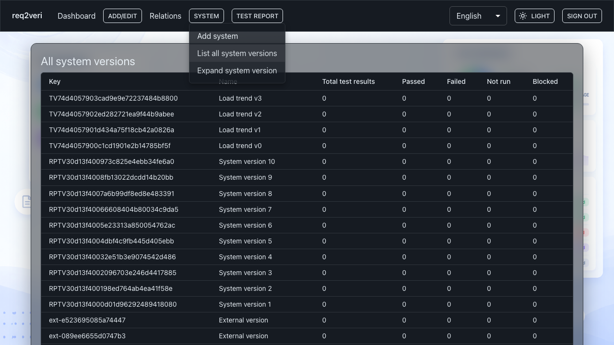

# System versions

**System versions** represent the product or configuration build you report test results against.

## 1. List of system versions

**Why:** Choose which version a test run targets when reporting; compare coverage across versions.

**How:** **System** → **List all system versions** opens `/systems`.

---

