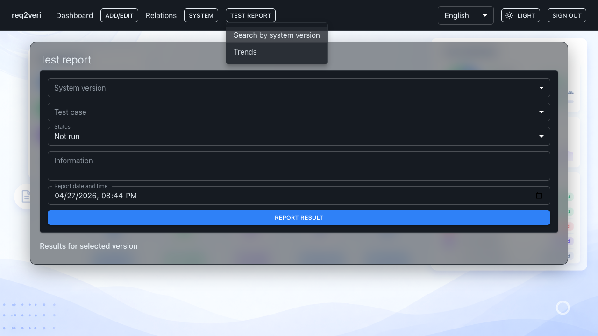

# Test report

**Test report** is where you record and browse results for a system version and test case.

## 1. Search by system version and test

**Why:** Link stored runs to a specific version and test, with notes and who reported the run.

**How:** **Test report** → **Search by system version** — select version and test, then report or read rows.

---

