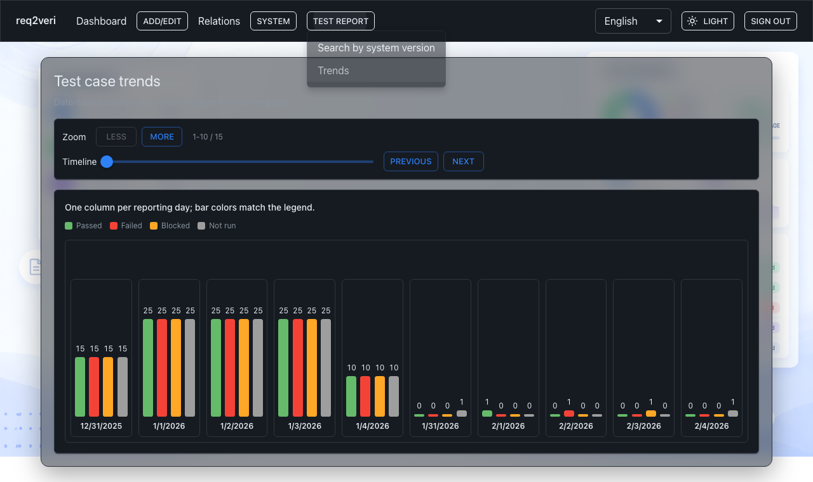

# Test report trends

**Trends** show how test outcomes evolve over calendar time for reporting / retrospectives.

## 1. Trends over time

**Why:** See whether quality is improving and spot days with clusters of fails or blockers.

**How:** **Test report** → **Trends** to open the chart (URL `/test-report/trends`).

---

