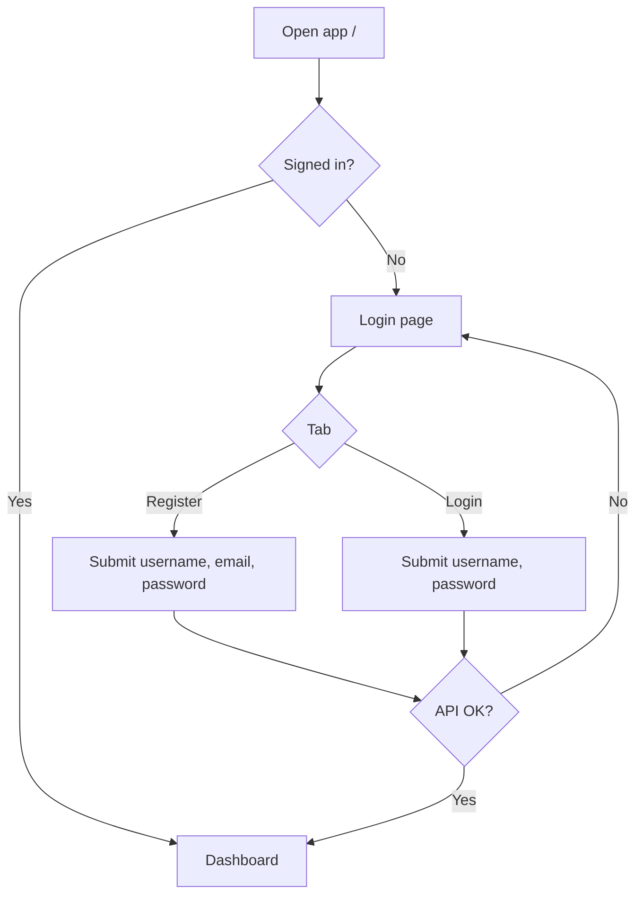
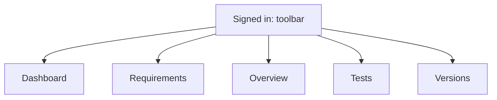
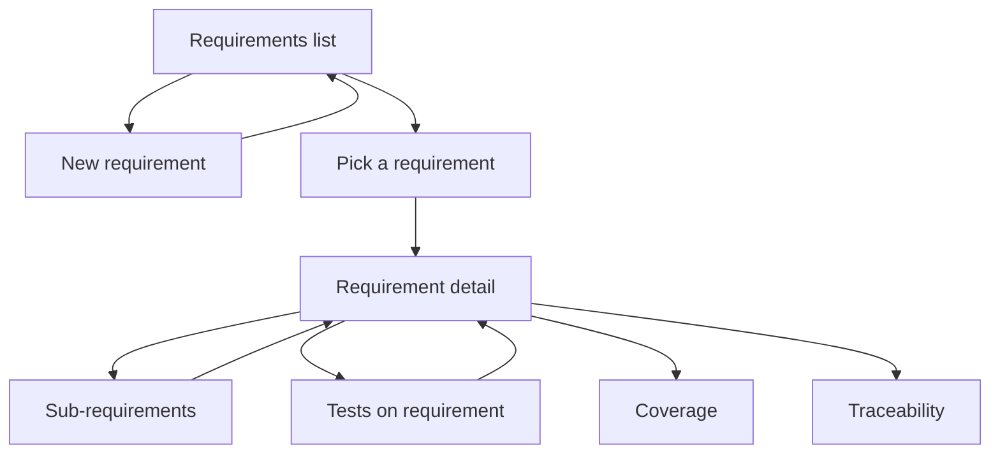
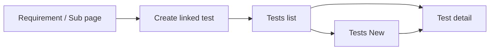

# Using the req2veri web UI

Assumes the app is open in the browser (e.g. **http://localhost:5173/** after `npm run dev` or your Compose/Kubernetes URL from the root [README](../README.md)).

Diagrams use [Mermaid](https://mermaid.js.org/) (renders on GitHub and in many IDEs).

## Sign in

1. Open **/login** (or the home URL; you are redirected there when not signed in).
2. **Register** (tab): pick username, email, and password, then submit — you are logged in and sent to the dashboard.
3. **Login** (tab): username + password, then submit.

The API must be reachable (`/api` is proxied to the backend in dev; see [README](README.md) if calls fail).

## Main navigation (after login)

| Link in the bar | What it is |
|-----------------|------------|
| **Dashboard** | Counts: requirements, sub-requirements, tests, verification status. |
| **Requirements** | Searchable list; open a row for detail. |
| **Overview** | Tree: each requirement with its sub-requirements. |
| **Tests** | All verification tests; filters and links to a test’s detail page. |
| **Versions** | Test object versions and recording runs against a version. |

Use **Logout** when you are done on a shared machine.

## Typical flows

**Create a requirement**  
Requirements → **New** (or `/requirements/new`) → fill key, title, text, status, priority → save. You return to the list or can open the new item.

**Work on one requirement**  
From the list, open a requirement. There you can edit fields, add **sub-requirements**, attach **tests** linked to the requirement, see **coverage**, **traceability** (requirement + subs + tests), and **Updated** metadata.

**Tests without a requirement**  
Tests → **New** (or `/tests/new`) to create a standalone test, or create from a requirement / sub-requirement context on the relevant page.

**Inspect or edit one test**  
From **Tests**, open a row → detail page (status, method, links, results).

## Language and theme

- **Language** dropdown (toolbar): English, Swedish, German — choice is stored in the browser.
- **Light / Dark** toggles the UI theme.

## API docs from the browser

With the default dev proxy, OpenAPI is at **http://localhost:5173/api/docs** (same host as the UI).
